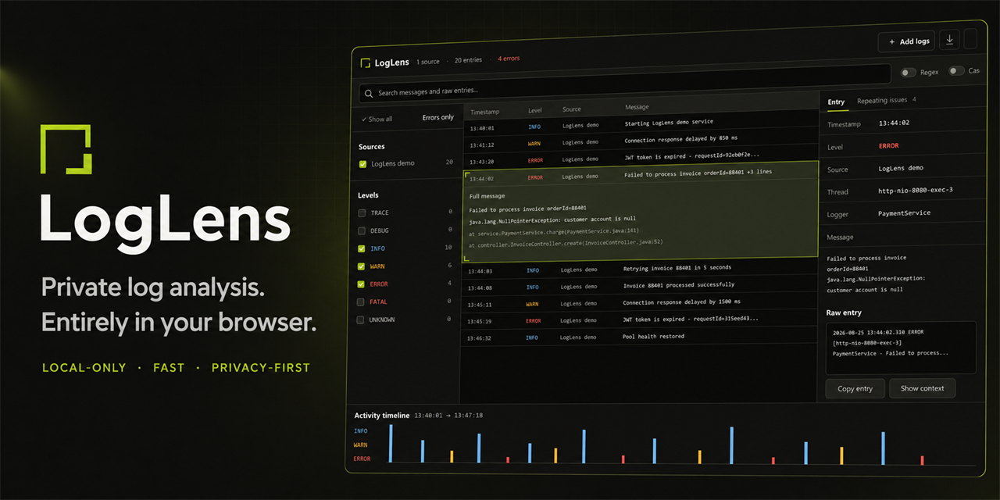

<h1>Hi, I'm Iliya 👋</h1>

  <strong>Software Developer</strong> 
  Java · Spring Boot · PostgreSQL · React · TypeScript

  I build practical full-stack products with a backend-first mindset — 
  clean architecture, meaningful business logic and interfaces people enjoy using.

## About me

- 💻 Building backend systems with **Java, Spring Boot and PostgreSQL**
- 🌐 Creating full-stack products with **React and TypeScript**
- 🧩 Interested in **architecture, integrations, security and automation**
- 🐳 Comfortable with **Docker, Git, Linux and CI/CD**
- 🚀 I learn best by turning real problems into working software

## Tech

  
  
  
  
  
  
  
  

## Featured projects

### 🌍 Travel Memory Map

**A full-stack platform that turns trips into interactive digital stories.**

 

  
  
  
  
  
  
  

Travel Memory Map combines trip planning, memories, collaboration and personal analytics in one cohesive application.

**Highlights:**

- 🗺️ Interactive maps, timelines and road-aware **Trip Replay**
- 🔐 Supabase authentication, role-based access and secure trip invitations
- 📸 Private photo memories with signed access links
- 💰 Shared expenses, participants and settlement calculations
- 🌍 World map, travel statistics, trip comparison and **Travel DNA**
- 🧪 Backend and frontend tests with automated deployment

  
  

---

### 🔎 LogLens

**A privacy-first browser workbench for turning raw logs into an investigation timeline.**

 

  
  
  
  
  

LogLens transforms pasted terminal output and local log files into a focused investigation workspace without uploading sensitive data.

**Highlights:**

- 🔍 Plain-text and regular-expression search
- 🎛️ Combined source, severity and timeline filters
- 🧩 Structured parsing for common application and system log formats
- 🔁 Conservative grouping of repeating warnings and errors
- ⚡ Web Worker parsing and virtualized rendering for large inputs
- 🔒 Fully client-side processing with no backend or log persistence
- 🧪 Automated tests, linting and GitHub Pages deployment

  
  

---

### 🎬 Cinepick

**A movie and TV discovery app focused on helping you find what to watch next.**

The portfolio preview uses original fictional artwork. The live application loads catalog data from TMDB.

  

  
  
  
  
  

Cinepick combines live movie and TV data with personalized discovery, user collections and synchronized account data.

**Highlights:** recommendations · authentication · watchlists and favorites · viewing progress · responsive UI · automated deployment

  
  

---

### 🌱 Полей ме!

**A lightweight Windows desktop widget for keeping plant-watering schedules organized.**

  
  &nbsp;
  

  
  
  
  
  

Полей ме! is a local-first desktop application that tracks individual watering schedules and keeps plants ordered by urgency.

**Highlights:**

- 💧 Individual watering schedules and clear urgency states
- 🔔 Native Windows notifications and automatic startup
- 🪴 Quick watering, editing and undo actions
- 📌 Compact desktop widget with system tray integration
- 💾 Local storage with JSON import and export
- 🔒 No accounts, telemetry or external backend

  
  

## Other interests

🤖 **Local LLM and automation experiments** — practical AI-assisted workflows, tooling and integrations.

## What I like working on

| Backend | Full stack | Engineering |
| :-- | :-- | :-- |
| APIs and services | React applications | Clean architecture |
| Databases | Product interfaces | Testing |
| Integrations | End-to-end features | Automation |

<strong>Build it. Understand it. Improve it.</strong>

