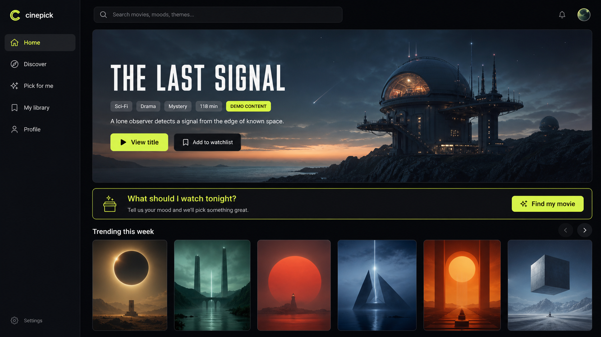

<h1>Hi, I'm Iliya 👋</h1>

  <strong>Software Developer</strong> 
  Backend systems · Web applications · System integration

  I build practical software and enjoy turning messy logic into smaller, testable, maintainable pieces.

## About me

💻 Mostly working with **Java, Spring Boot and PostgreSQL**

🧩 Interested in **backend architecture, integrations and automation**

🌐 I also build **React / TypeScript** applications and full-stack side projects

🐳 Comfortable with **Docker, Git and Linux**

🚀 I prefer **real projects and real problems** over tutorial clones

## Tech

  
  
  
  
  
  
  
  

## Featured work

### 🎬 Cinepick

**A movie & TV discovery app focused on helping you find what to watch next.**

The portfolio preview uses original fictional demo artwork. The live application loads catalog data from TMDB.

  

  
  
  
  
  

Cinepick combines live movie and TV data with personalized discovery, user collections and synced account data.

**Highlights:** recommendations · authentication · watchlists & favorites · viewing progress · responsive UI · automated deployment

  
  

### 🤖 Local LLM / Automation Experiments

Experiments with local language models, automation and practical AI-assisted workflows.

`Java` · `LLMs` · `Automation`

## What I like working on

| | |
|---|---|
| Backend services | System integration |
| Clean architecture | Automation |
| APIs | Databases |
| Testing | Practical tooling |

<strong>Build it. Understand it. Improve it.</strong>

